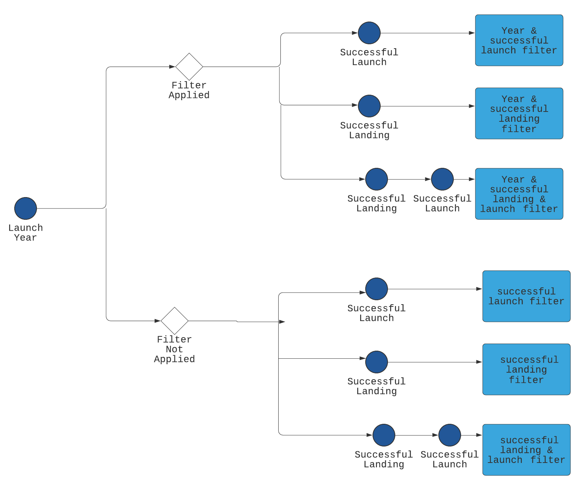

# SpaceX_Database_App

### INTRODUCTION

The SpaceX Database App contains all information about the SpaceX program, including its launch year, launch success, and land success. We can filter the data according to Launch Year, Successful launch, and Successful landing, making the data analysis a seamless process.

### Link to the App :

https://frozen-cliffs-94654.herokuapp.com

### Techonologies used for creating the App

#### Frontend : HTML,CSS,Javascript,Bootstrap
#### Backend  : Node.js, Express.js

### Approach 

1. Load the initial data using the request package of express.js and displayed it using the bootstrap table.
2. For filters, use two checkboxes for  **Successful launch** and **Successful landing** and one text input for **launch year**.
3. According to the filter form's input, the APIs' data is filtered and the home templated in rendered with the filtered data.

### Flowchart 

### App screenshots

### API's used for fetching data

1. https://api.spacexdata.com/v3/launches?limit=100 (without any filters)
2. https://api.spacexdata.com/v3/launches?limit=100&launch_success=true (launch success true)
3. https://api.spacexdata.com/v3/launches?limit=100&launch_success=true&land_success=true (launch and land success true)
4. https://api.spacexdata.com/v3/launches?limit=100&launch_success=true&land_success=true&launch_year=2014 (all filters applied)

